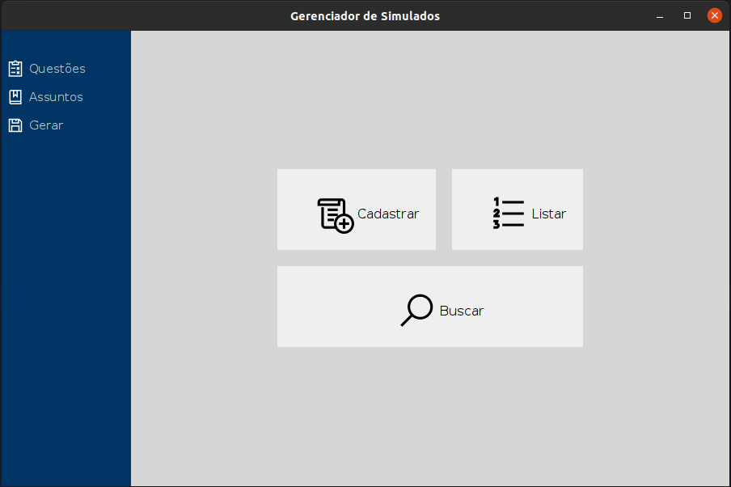

# Question Bank and Mock and Tests Generator in Java

[versão em português](README.pt.md)

Object Oriented Programming (OOP) Discipline project, made in the second semester
of graduation on Computer Science at Tocantins Federal University. Project made
to learn OOP, UI programming in Java, data persistence, project management, and teamwork.

The desktop program aims to maintain a question bank
for mock and tests, allowing registration, listing, search, and editing
of questions. Besides that, it is possible to generate PDFs, and CSVs
of tests with questions assorted or filtered by subject.

Integrantes e Colaboradores:
- Mateus da Silva Rosario - [github](https://github.com/MateusRosario)
- Ricardo Henrrique Souza Machado - [github](https://github.com/ricardosousa339)
- Matheus Almeida Farias da Silva - [github](https://github.com/matheusjv11)