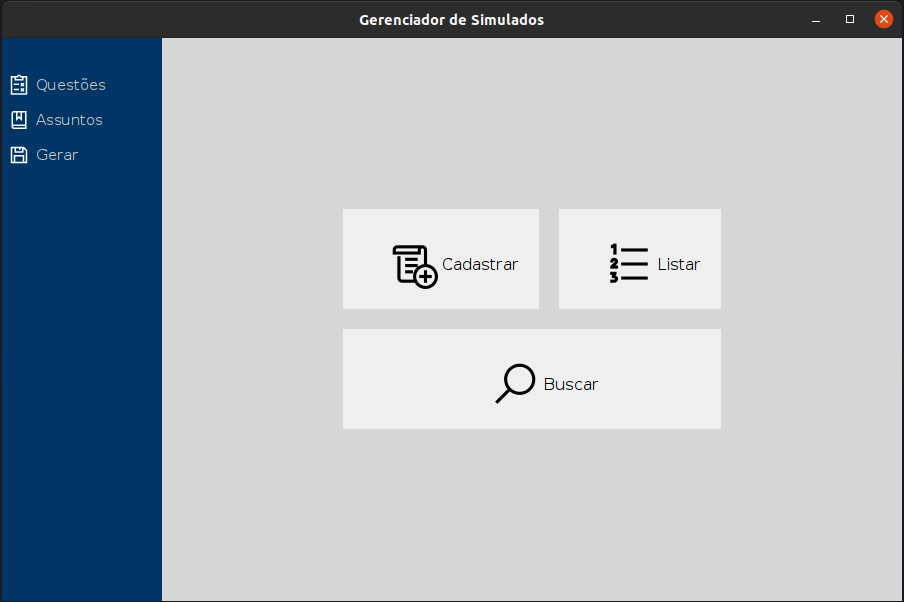

# Banco de Questões e Gerador de Provas e Simulados em Java

[english version](README.md)

Projeto da disciplina de Programação Orientada a Objetos (POO), 
feito no segundo semestre da graduação em Ciência da Computação
da Universidade Federal do Tocantins. Projeto feito com o 
intuito de aprender sobre POO, programação de Interfaces em 
Java, persistência de dados, gerência de projetos e trabalho
em equipe.

O programa Desktop tem o objetivo de manter um banco de questões
de provas e simulados, permitindo cadastro, listagem, pesquisa e
edição. Além disto é possível gerar PDFs e CSVs de provas e 
gabaritos com questões sortidas ou filtradas por assunto.

Integrantes e Colaboradores:
- Mateus da Silva Rosario - [github](https://github.com/MateusRosario)
- Ricardo Henrrique Souza Machado - [github](https://github.com/ricardosousa339)
- Matheus Almeida Farias da Silva - [github](https://github.com/matheusjv11)